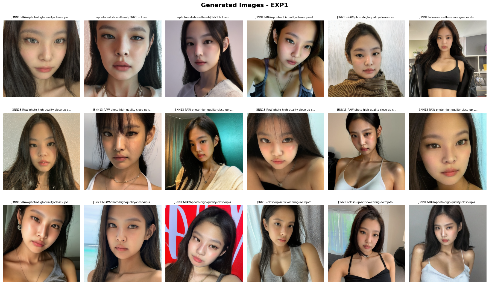
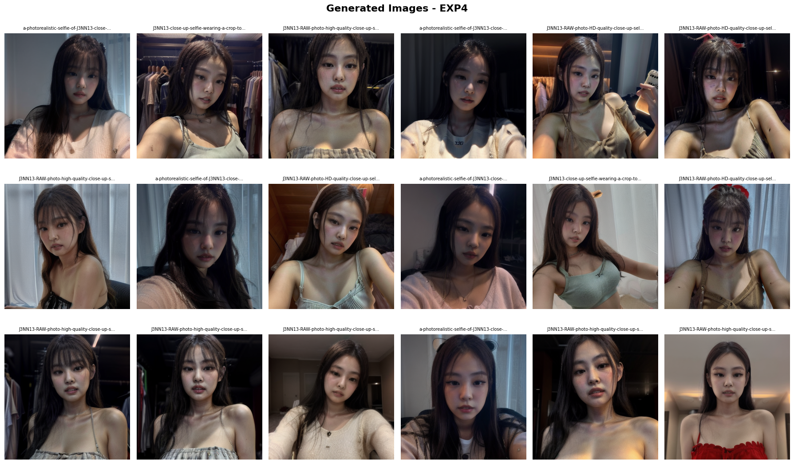
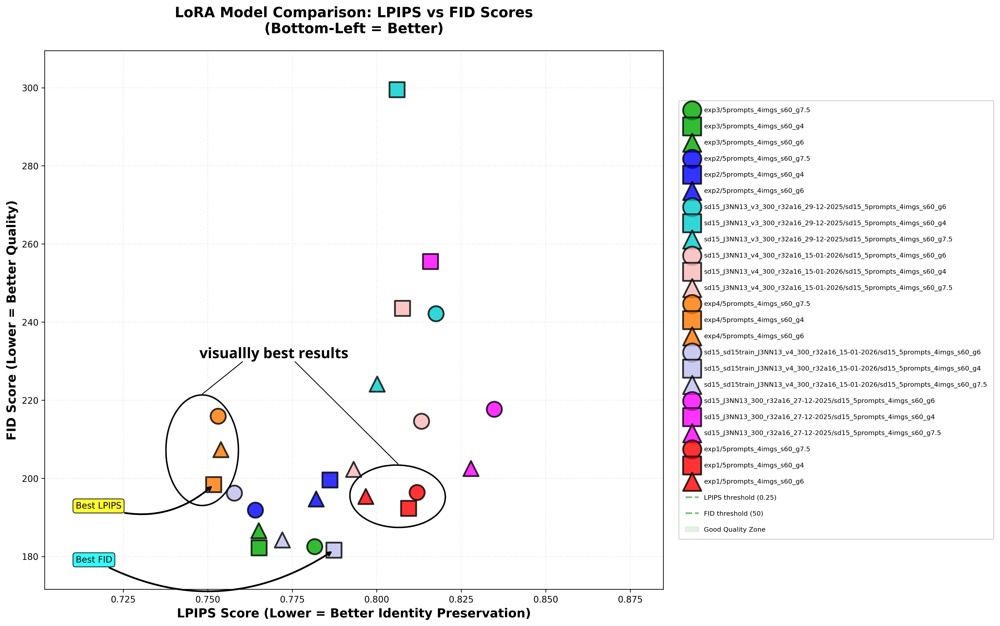

# Stable Diffusion Fine-Tuning

A PyTorch-based project for fine-tuning Stable Diffusion models on custom datasets. This repository provides Python scripts for training the model with specific visual concepts and generating high-quality images based on your fine-tuned model.

## Results

Report for this project can be found in `docs/report.pdf`

### Experiment 1: Baseline with Simple Trigger Word (v1 Captions)

<!--  -->


### Experiment 4: Cross-Model Transfer Learning



## Features

- **Model Fine-tuning**: Train Stable Diffusion on custom datasets using LoRA or full model fine-tuning
- **Image Generation**: Generate images with configurable parameters (guidance scale, steps, etc.)
- **Dataset Preparation**: Tools for preparing and preprocessing training datasets
- **Configuration-based Training**: Easy-to-configure training through YAML files

## Requirements

- Python 3.8+
- PyTorch (GPU recommended)
- CUDA 11.0+ (for GPU support)
- conda or pip for dependency management

See `conda.yaml` for the complete list of dependencies.

## Installation

```bash
# Clone the repository
git clone <repo-url>
cd stable-diffusion-finetuning

# Create conda environment (recommended)
conda env create -f conda.yaml
conda activate stable-diffusion-ft

# Or install dependencies with pip
pip install -r requirements.txt
```

## Project Structure

- Pretrained LoRA weights can be found in `runs.zip`
- Training dataset can be found in `dataset.zip`

```
src/
├── train.py                  # Main training script
├── gen.py                    # Image generation script
├── gen_full.py               # Full pipeline generation script
├── dataset.py               # Dataset utilities and loaders
├── evaluate.py              # Evaluation metrics (FID, LPIPS)
├── plot.ipynb               # Visualization and plotting notebook
├── training_config.yaml     # Training hyperparameters
└── generation_config.yaml   # Generation settings

testgen/                     # Test generation outputs
├── exp1/ - exp4/            # Test images for each experiment
└── sd15_*/                  # Stable Diffusion v1.5 variants

metrics/                     # Evaluation metrics (FID, LPIPS)
├── exp1/ - exp4/            # Metrics for baseline experiments
└── sd15_*/                  # Metrics for SD v1.5 variants

docs/                        # Documentation
├── report.tex               # LaTeX report
├── evaluation_guide.md      # Detailed evaluation guide
└── assets/                  # Research assets and experimental results
    ├── literature.bib       # Bibliography
    └── exp1/ - exp4/        # Experiment figures
```

## Usage

### Training

Configure your training parameters in `src/training_config.yaml`, then run:

```bash
cd src
python train.py
```

To run training in the background:

```bash
nohup python train.py > training.log 2>&1 &
```

### Image Generation

Configure generation settings in `src/generation_config.yaml`, then run:

```bash
cd src
python gen.py
```

## Configuration

Edit the YAML files to customize training and generation:

- **training_config.yaml**: Learning rate, batch size, epochs, model architecture
- **generation_config.yaml**: Number of images, inference steps, guidance scale, prompts

## Metrics Summary



LPIPS and FID scores across all experiments, showing trade-offs between identity preservation and overall generation quality.

Generated images and experiments are stored in the `generation/` directory organized by experiment configurations and timestamps.
