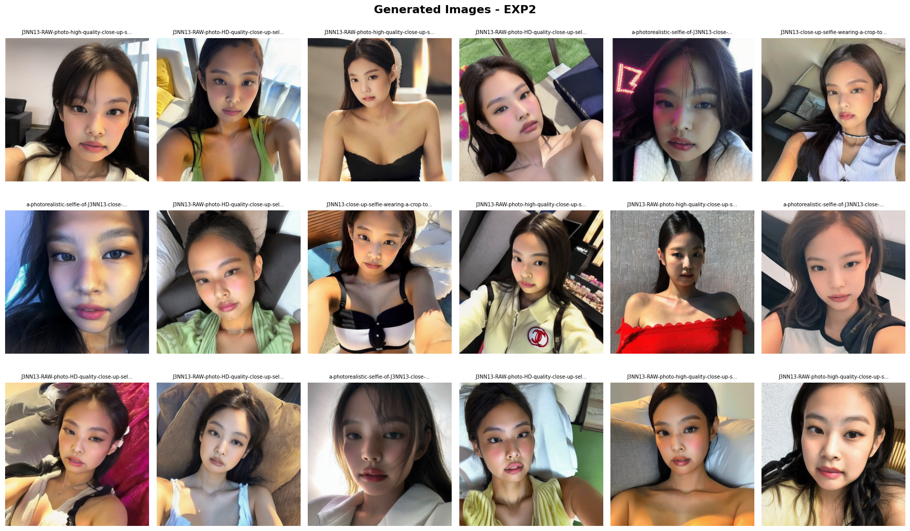
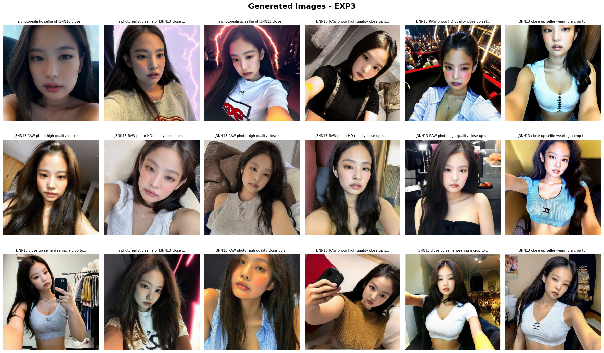

# Stable Diffusion Fine-Tuning

A PyTorch-based project for fine-tuning Stable Diffusion models on custom datasets. This repository provides tools for training the model with specific visual concepts and generating high-quality images based on your fine-tuned model.

## Features

- **Model Fine-tuning**: Train Stable Diffusion on custom datasets using LoRA or full model fine-tuning
- **Image Generation**: Generate images with configurable parameters (guidance scale, steps, etc.)
- **Dataset Preparation**: Tools for preparing and preprocessing training datasets
- **Configuration-based Training**: Easy-to-configure training through YAML files

## Requirements

- Python 3.8+
- PyTorch (GPU recommended)
- CUDA 11.0+ (for GPU support)
- conda or pip for dependency management

See `conda.yaml` for the complete list of dependencies.

## Installation

```bash
# Clone the repository
git clone <repo-url>
cd stable-diffusion-finetuning

# Create conda environment (recommended)
conda env create -f conda.yaml
conda activate stable-diffusion-ft

# Or install dependencies with pip
pip install -r requirements.txt
```

## Project Structure

```
src/
├── train.py                  # Main training script
├── gen.py                    # Image generation script
├── dataset.py               # Dataset utilities and loaders
├── stl10prepare.py          # STL-10 dataset preparation
├── training_config.yaml     # Training hyperparameters
└── generation_config.yaml   # Generation settings

generation/                  # Generated images and configs
└── [experiment_dirs]/
```

## Usage

### Training

Configure your training parameters in `src/training_config.yaml`, then run:

```bash
cd src
python train.py
```

To run training in the background:

```bash
nohup python train.py > training.log 2>&1 &
```

### Image Generation

Configure generation settings in `src/generation_config.yaml`, then run:

```bash
cd src
python gen.py
```

## Configuration

Edit the YAML files to customize training and generation:

- **training_config.yaml**: Learning rate, batch size, epochs, model architecture
- **generation_config.yaml**: Number of images, inference steps, guidance scale, prompts

## Results

### Experiment 1: Baseline with Simple Trigger Word (v1 Captions)


Single unique trigger word "J3NN13" with minimal contextual information. Achieves reasonable identity preservation but limited to close-up portraits similar to training images.

### Experiment 2: Detailed Attribute Tags (v2 Captions)



Rich keyword annotations combining trigger word with detailed attribute descriptors (expressions, camera framing, appearance details). Provides diverse contextual information but requires more training for optimal results.

### Experiment 3: Simplified Attribute Tags (v3 Captions)



Balanced approach with simplified comma-separated keywords focusing on essential identity and contextual features. Good balance between annotation simplicity and attribute diversity.

### Experiment 4: Cross-Model Transfer Learning


LoRA weights trained on Stable Diffusion v1.5 with v3 captions, then applied to Realistic Vision model for inference. Demonstrates best identity preservation (lowest LPIPS of 0.752) by leveraging photorealistic model capabilities.

### Metrics Summary


LPIPS and FID scores across all experiments, showing trade-offs between identity preservation and overall generation quality.

Generated images and experiments are stored in the `generation/` directory organized by experiment configurations and timestamps.
